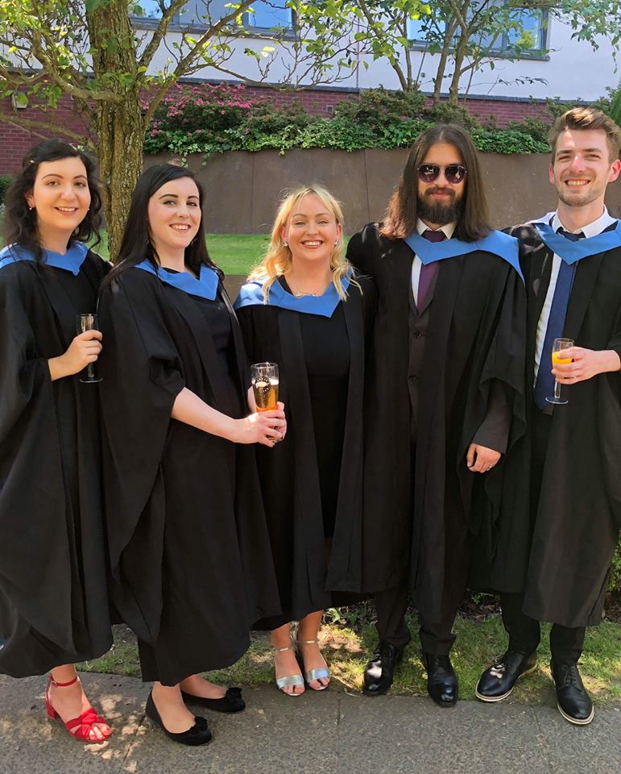

### University of Glasgow

Currently enrolled in Msc Research Methods in Psychological Science at the Unversity of Glasgow. 
Attending classes such as:

* Data Skills for Reproducible Science
* Introduction to Matlab
*	Professional Skills
*	Qualitative methods
*	Research Methods in Cognitive Science
*	Social Robotics
*	Statistics and Research Design

&nbsp;

&nbsp;

### University of Strathclyde 

Graduated from the University of Strathclyde with a  Bachelor of Arts degree in Psychology in June 2018. Second class, upper division. 

&nbsp;

&nbsp;

&nbsp;

Attended classes in areas such as:

* Artificial Intelligence
* Developmental Psychology
* Individual Differences
* Neuropsychology of Ageing and Dementia
* Physiological Psychology
* Psychology and Cognitive Neuroscience of Face Recognition
* Psychology of Mental Health
* Research Methods in Psychology
* Social Psychology

