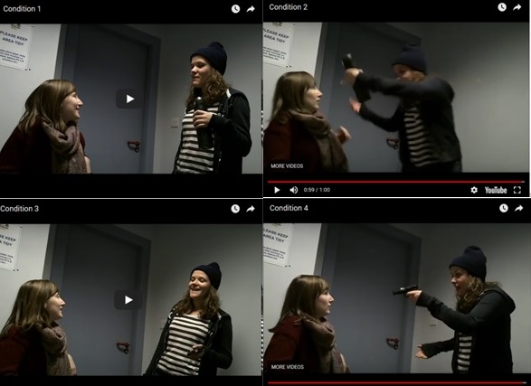
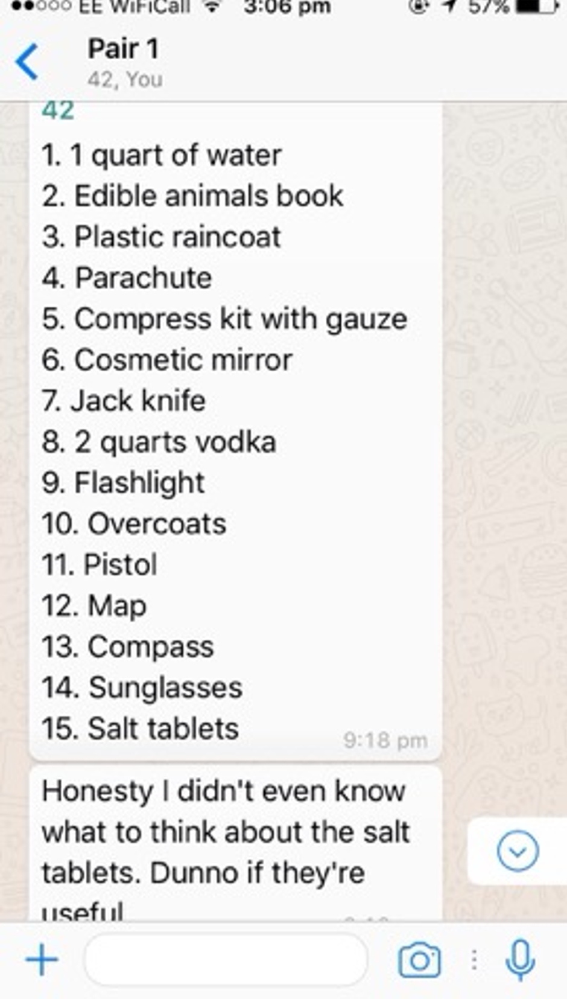
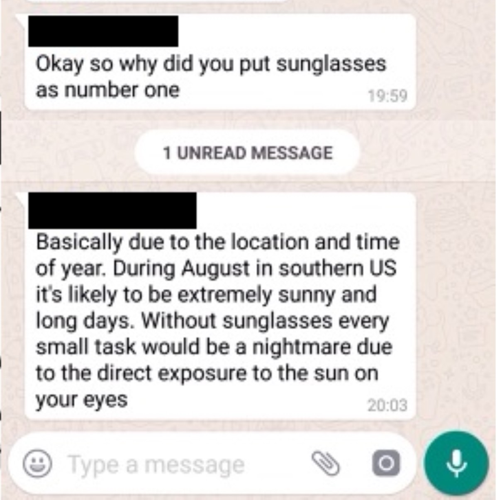

### University of Strathclyde
For my undergraduate dissertation, i developed a study investigating explanations for the Weapon Focus effect in eyewitness testimony, supervised by [Dr Steven Kelly](https://pureportal.strath.ac.uk/en/persons/stephen-kelly). 

The weapon focus effect, defined as a drop in memory performance for a scene caused by the presence of a weapon, has been explained through two hypothesis. The arousal/threat hypothesis attributes the weapon focus effect effect to attentional narrowing caused by physiological stress, whereas the unusual item hypothesis claims the memory
deficit comes from difficulty processing objects schematically incongruent for their context,
which causes them to draw more attention at memory encoding, at the expense of memory for
other details. These explanations were investigated using a 2 x 2 independent measures design, manipulating threat and item unusualness. 

### University of Twente
From June to August 2017, I undertook an Erasmus summer internship at the University of Twente, working in the [Psychology of Conflict, Risk, and Safety](https://www.utwente.nl/en/bms/pcrv/) department. There i worked with two other Erasmus students to develop a project investigating linguistic indicators of online deception in modern instant messaging platforms, under the supervision of [Dr. Marielle Stel](https://people.utwente.nl/m.stel). In order to investigate this, participants were paired into whatsapp groups anonymously, and asked to solve the Desert Survival problem. In this hypothetical scenario, participants are told to imagine their aeroplane had crashed in the desert, and they had a list of 15 salvageable items to help ensure their survival (such as water, a pistol, waterproof clothing). They were instructed to reach a consensual ranking from most to least important in terms of survival value. In this study, participants in the experimental condition were designated the "deceiver", and were briefed on different deception strategies, and tasked with giving counterproductive advice in order to ultimately sabotage the survival attempt. Participant's word count, use of informal language, and emoji use was analysed. 

Example of truthful participant. Here they can be seen presenting a the items in a ranking they believe in

Example of a deceitful participant. Here they can be seen attempting to justify their choice of item rankings

During my internship at Twente, I also assisted in producing materials for a project developed by  [Dr Marco Van Bommel](https://nl.linkedin.com/in/marco-van-bommel-745a5b60) investigating the effects of sexual harassment experience through the medium of virtual reality. Factors such as the location where the harassment takes place, the sex of the harasser, and the level of harasser aggression were manipulated while filming the materials.

### University of Glasgow

Currently, i am developing a project investigating simulations of eating behaviour, expanding on the research of [Esther Papies](https://www.gla.ac.uk/schools/psychology/staff/estherpapies/), and supervised by [Maxine Swingler](https://www.gla.ac.uk/schools/psychology/staff/maxineswingler/). Grounded cognition theory explains that as a food is encountered in a situation, different neural systems encode different aspects of the situation, which are integrated into a global picture. These stored experiences knowledge form simulations of how an individual typically experiences the target food. This project will build on previous work investigating eating simulations through feature listing tasks with a series of semi-structured interviews with participants, in order to get a deeper understanding of how these simulations are formed, and how they influence the motivation to consume certain kinds of food. 
