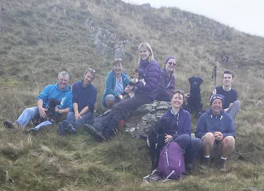
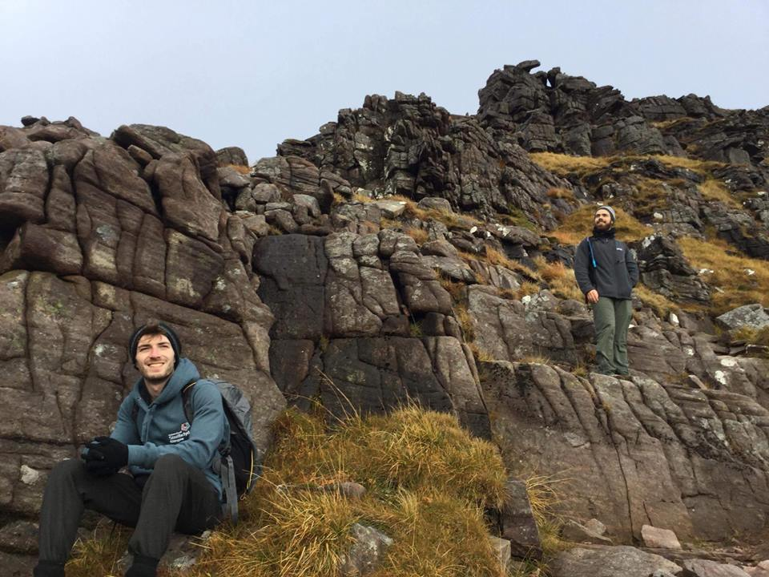
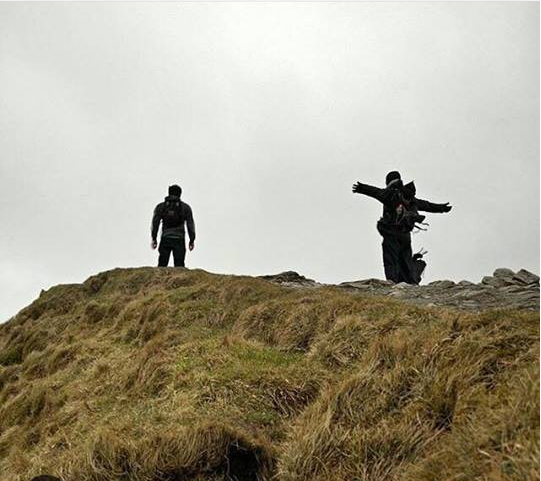
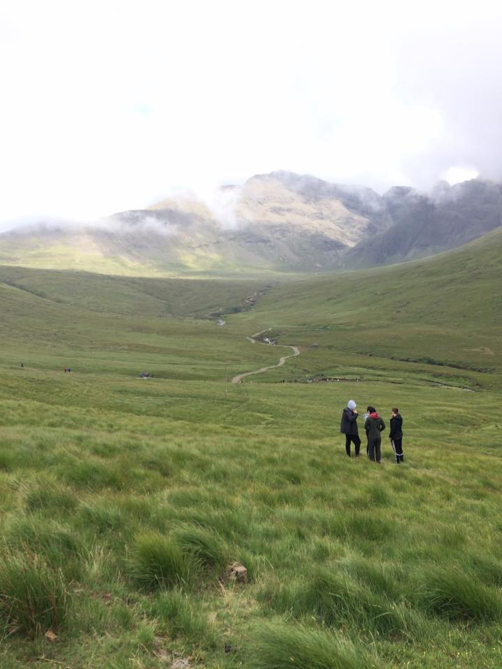
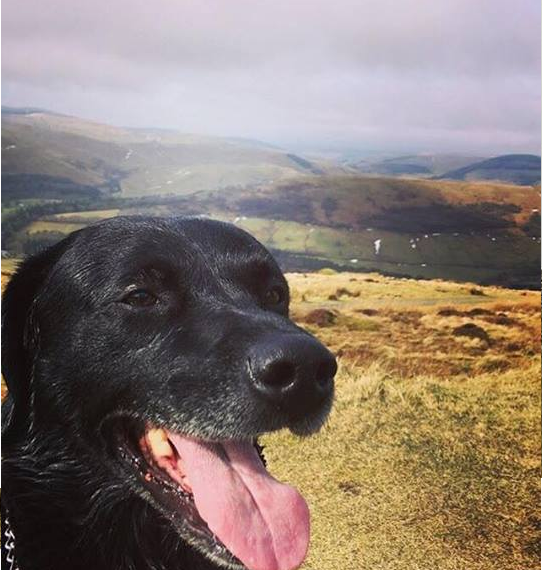
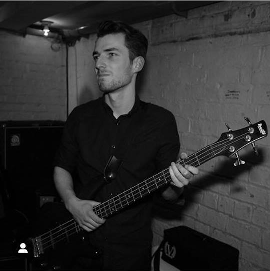
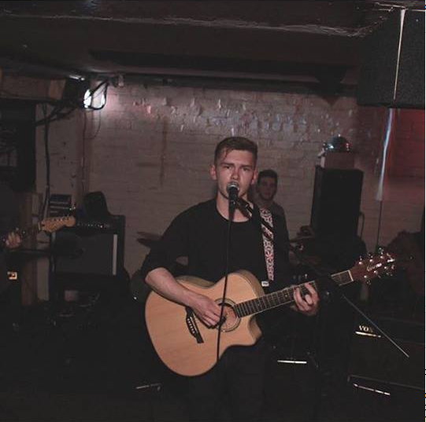
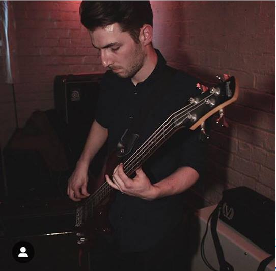

###Hiking
Outside of academia, I have a keen interest in hiking, mountain climbing, and camping. I am an active member in the Glasgow University Mountaineering club, and frequently climb munros in the Loch Lomond national park, The Lake District, and areas along the west coast of Scotland, such as Torridon. 

&nbsp;

&nbsp;

###Music

As well as climbing, i have an interest in creating and playing music. I play mostly bass guitar, and dabble in ukulele. My former band once performed at [The 13th Note.](http://13thnote.co.uk/) 

&nbsp;

