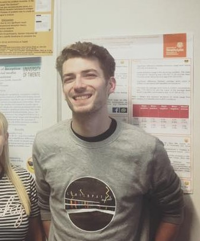

My name is Ryan Smith, and I am a postgraduate student in the University of Glasgow's
[Institute of Neuroscience and Psychology](http://www.gla.ac.uk/researchinstitutes/neurosciencepsychology/).
I work with [Dr. Maxine Swingler](https://www.gla.ac.uk/schools/psychology/staff/maxineswingler/)

### Education

Graduated from the University of Strathclyde in 2014 with a 2:1 BA Psychology degree. Currently enrolled in Msc Research Methods in Psychological Science at the University of Glasgow. 

### Research experience

For my undergraduate dissertation, i developed a study investigating explanations for the Weapon Focus effect in eyewitness testimony, supervised by [Dr Steven Kelly](https://pureportal.strath.ac.uk/en/persons/stephen-kelly). 

From June to August 2017, I undertook an Erasmus summer internship at the University of Twente, working in the [Psychology of Conflict, Risk, and Safety](https://www.utwente.nl/en/bms/pcrv/) department. There i worked with two other Erasmus students to develop a project investigating linguistic indicators of online deception in modern instant messaging platforms, under the supervision of [Dr. Marielle Stel](https://people.utwente.nl/m.stel). I also assisted in a project developed by  [Dr Marco Van Bommel](https://nl.linkedin.com/in/marco-van-bommel-745a5b60) investigating the effects of sexual harassment experience through the medium of virtual reality. 

### Previous work: summarised
* University of Strathclyde
      * study
      * study
* University of Twente
      * study
* University of Glasgow
      * study
  

